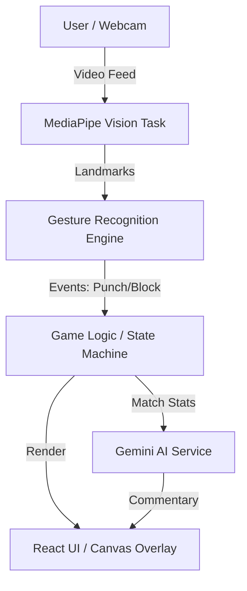

# Baka Gesture Fighter

A web-based interactive fighting game controlled by real-time hand gestures using computer vision, featuring AI-generated commentary.

## Abstract
This project implements a gesture-controlled gaming experience directly in the browser. By leveraging Google's MediaPipe for low-latency hand tracking and Google Gemini for dynamic, context-aware post-match commentary, it creates an immersive augmented reality interface without requiring specialized hardware. The application demonstrates the integration of edge-based computer vision with cloud-based generative AI in a modern web architecture.

## Introduction
Baka Gesture Fighter is an experimental web application that transforms user webcam input into game controls. Users engage in virtual combat by performing specific hand gestures (punches, blocks) detected in real-time. The system provides immediate visual feedback and concludes matches with unique, spirited commentary generated by an LLM based on performance statistics.

## Problem Statement
Traditional browser games rely on keyboard/mouse or gamepad inputs, creating a barrier to physical immersion. Existing motion-control solutions often require dedicated hardware or heavy software installations. This project aims to solve this by providing a hardware-free, zero-install motion control interface accessible on standard devices with a webcam.

## Objectives
*   Develop a real-time gesture recognition system using a standard webcam.
*   Implement a state-driven game loop (Title -> Playing -> Result).
*   Integrate Generative AI to provide unique, personalized match commentary.
*   Ensure performance suitable for 60fps gameplay on standard consumer hardware.
*   Deploy a scalable, serverless frontend application.

## System Architecture
The application follows a component-based frontend architecture powered by React, with a service layer handling external AI interactions.



## Data Flow Diagram (DFD)

### Level 0: Context Diagram
```ascii
   +-----------+                +-------------------------+
   |           |  Gestures      |                         |
   |   User    | -------------> |   Baka Gesture Fighter  |
   |           | <------------- |       System            |
   |           |  Visuals/Audio |                         |
   +-----------+                +-------------------------+
                                        |      ^
                             Match Data |      | Commentary
                                        v      |
                                +-----------------------+
                                |  Google Gemini API    |
                                +-----------------------+
```

### Level 1: Detailed Flow
1.  **Input Acquisition**: Webcam frame captured via HTML5 Video API.
2.  **Processing**: MediaPipe processes the frame to extract hand skeletal landmarks.
3.  **Interpretation**: Geometry-based logic detects specific poses (fist closed vs open).
4.  **State Update**: Game state updates player health, combo, and score based on detected gestures.
5.  **Rendering**: React updates the DOM; Canvas draws visual effects.
6.  **Analysis**: Upon game end, performance metrics are sent to Gemini API.
7.  **Response**: AI generates a commentary string displayed on the result screen.

## Technology Stack

| Component | Technology | Description |
| :--- | :--- | :--- |
| **Frontend Framework** | React 19 | UI Component structure and state management |
| **Build Tool** | Vite | Fast development server and bundler |
| **Language** | TypeScript | Type-safe logic and data models |
| **Computer Vision** | MediaPipe Tasks Vision | Real-time hand landmark detection |
| **Generative AI** | Google GenAI SDK | Gemini 1.5 Flash for text generation |
| **Styling** | Tailwind CSS | Utility-first styling for UI |
| **Hosting** | Cloudflare Pages | Static site hosting and CD |

## Data / Input Description
*   **Video Input**: 640x480 (typical) webcam stream processed locally.
*   **Hand Landmarks**: 21 3D coordinates per hand detected by MediaPipe.
*   **Game State**: Object containing Health (0-100), Score (Int), and Combo (Int).
*   **API Prompts**: Structured text templates injecting match statistics for the AI.

## Model / Core Logic Explanation
*   **Gesture Recognition**: The core logic calculates Euclidean distances between specific finger landmarks (e.g., thumb tip to index finger tip) to determine if a hand is "open" or "closed" (fist). It maps these states to game actions like "PUNCH" or "BLOCK".
*   **AI Commentary**: A prompt engineering approach is used where a persona ("intense fighting game announcer") is defined, and raw match stats are provided as context to generate creative text.

## Web App / UI Flow
1.  **Title Screen**: User grants camera permissions; system initializes AI models.
2.  **Game Screen**: High-frequency loop. User sees their video feed with game UI overlay (Health bars, Score). Gestures trigger animations and state changes.
3.  **Result Screen**: Displays final stats (Damage, Time) and fetches/displays the AI-generated commentary.

## Limitations
*   Requires good lighting conditions for accurate tracking.
*   Subject to API rate limits from Google Gemini.
*   Performance depends significantly on the client device's CPU/GPU for vision processing.
*   API Key is currently client-side (acceptable for prototype, risky for production).

## Future Enhancements
*   Multiplayer support via WebRTC.
*   Custom gesture recording and calibration.
*   Backend proxy implementation for secure API key handling.
*   Voice recognition for voice commands.

## How to Run the Project

### Prerequisites
*   Node.js (v18+)
*   npm

### Installation
1.  Clone the repository:
    ```bash
    git clone https://github.com/your-username/gesture-fighter.git
    cd gesture-fighter
    ```
2.  Install dependencies:
    ```bash
    npm install
    ```
3.  Set up Environment Variables:
    *   Create a `.env.local` file in the root.
    *   Add your Gemini API Key: `VITE_GEMINI_API_KEY=your_key_here` (Note: Ensure variable name matches `vite.config.ts` setup).

### Running Locally
```bash
npm run dev
```
Open `http://localhost:5173` in your browser.

### Deployment (Cloudflare Pages)
1.  Push to GitHub.
2.  Connect repository to Cloudflare Pages.
3.  Build Command: `npm run build`
4.  Output Directory: `dist`
5.  Add `GEMINI_API_KEY` to Cloudflare Project Settings.

## Author / Credits
*   **Developer**: [Your Name/Handle]
*   **Tools**: Google MediaPipe, Google Gemini, React ecosystem.
